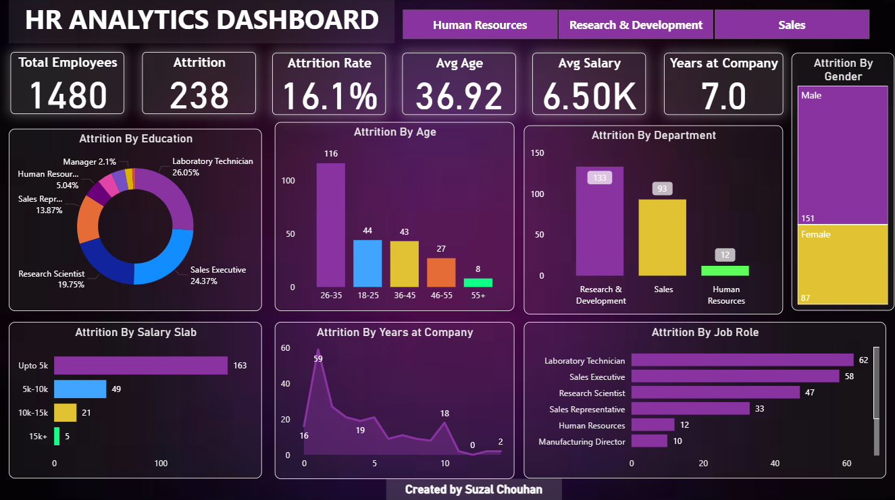

# 📊 HR Analytics Dashboard – Power BI  

This project is an **interactive HR Analytics Dashboard built in Power BI** that provides key insights into **employee attrition and workforce trends**. It helps HR teams and business leaders make **data-driven decisions** to improve retention and optimize employee experience.  

---

## 🔎 Key Insights  
The dashboard covers:  
- 👥 **Attrition by Age Group** – which age brackets are more likely to leave  
- 💰 **Attrition by Salary** – trends between pay levels and retention  
- 📌 **Reasons for Attrition** – top causes why employees leave  
- 🏢 **Attrition by Department/Job Role** – hotspots of employee turnover  
- 📈 **Overall Attrition Rate** – key KPI for workforce health  

---

## 🎯 Why This Project?  
Employee attrition is a critical business challenge. By transforming HR data into **visual insights**, this dashboard enables organizations to:  
- Identify patterns of turnover  
- Understand risk factors behind attrition  
- Build strategies for better employee engagement and retention  

---

## ⚙️ Tech Stack  
- **Power BI** – data visualization & dashboard design  
- **HR Dataset** – sample HR attrition dataset (structured for analysis)  

---

## 🚀 Getting Started  
1. Download the `.pbix` file from this repository.  
2. Open it in **Power BI Desktop**.  
3. Explore the interactive visuals and drilldowns.  

---

## 📷 Dashboard Preview  

---

## 🤝 Contributions  
This is a beginner-friendly project! If you’d like to:  
- Suggest new HR metrics  
- Add features (e.g., predictive attrition models)  
- Share feedback  

Feel free to fork this repo and open a pull request.  

---

## 📬 Connect with Me  
Hi, I’m **Suzal** 👋  
📌 Aspiring Data Analyst | Passionate about transforming data into insights.  

- 💼 [LinkedIn](https://www.linkedin.com/in/suzalchouhan4/)   
